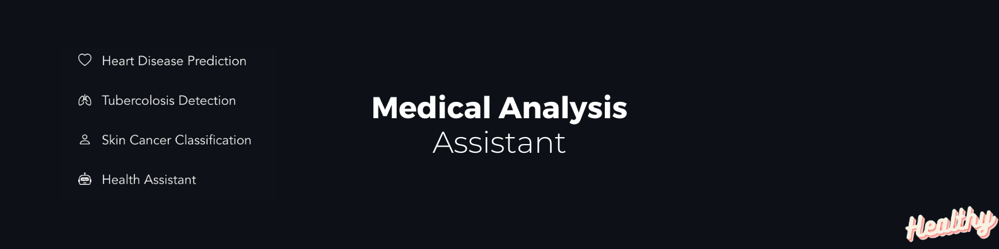

<div align="center">
  <br />
    <a href="https://medical-analysis-assistant.streamlit.app" target="_blank">
      
    </a>
  <br />

  <div>
    
    
    
    
</div>


  <h3 align="center">Medical Analysis Assistant</h3>

   <div align="center">
     The Medical Analysis Assistant is a holistic health companion, offering predictions for heart disease, tuberculosis detection, skin cancer classification, and expert insights through a user-friendly chat interface.
    </div>
</div>
<br/>

**Datasets** 🗃️
- [Heart Disease Cleveland UCI](https://www.kaggle.com/datasets/cherngs/heart-disease-cleveland-uci/data)
- [Skin Cancer](https://dataverse.harvard.edu/dataset.xhtml?persistentId=doi:10.7910/DVN/DBW86T)
`only HAM10000_images_part_1, .._part_2, and HAM10000_metadata.csv required`
- [Tuberculosis (TB) Chest X-ray Database](https://www.kaggle.com/datasets/tawsifurrahman/tuberculosis-tb-chest-xray-dataset)


## Setup & Installation
**Prerequisites**

Ensure the following are installed
- [Git](https://git-scm.com/)
- [Python](https://www.python.org/downloads/)
- [Jupter Notebook](https://jupyter.org/install) (or install the Jupyter extension on Visual Studio Code).
  
To set up this project locally, follow these steps:

1. Clone the repository:
```shell
git clone https://github.com/thebugged/medical-analysis-assistant.git
```

2. Change into the project directory: 
```shell
cd medical-analysis-assistant
```

3. Install the required dependencies: 
```shell
pip install -r requirements.txt
```
<br/>

## Running the application
1. Run the command: 
```shell
streamlit run main.py
```
2. Alternatively, you can run the `heart.ipynb`,`tb.ipynb`, and `skin.ipynb` notebooks to get their respective models then run the command in 1.

The application will be available in your browser at http://localhost:8501.


